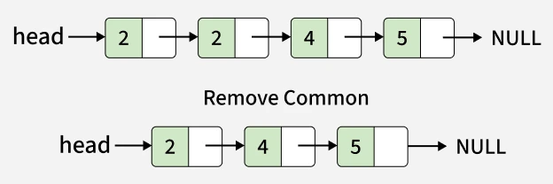
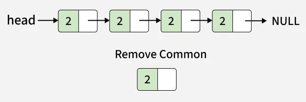

# Remove Duplicates Sorted Linked List

Problem Link: https://www.geeksforgeeks.org/problems/remove-duplicate-element-from-sorted-linked-list/1

---

## Problem Statement

Given the head of a sorted singly linked list, remove all duplicate nodes so that each element appears only once. The resulting linked list should remain sorted.

Note: Try to solve the problem without using extra space.

---

## Examples

### Example 1

```text
Input:
Head: 2->2->4->5

Output:
2 -> 4 -> 5



Explanation:
In the given linked list 2 -> 2 -> 4 -> 5, only 2 occurs more than 1 time. So we need to remove it once.
```

### Example 2

```text
Input:
Head: 2->2->2->2->2

Output:
2



Explanation:
In the given linked list  2 -> 2 -> 2 -> 2, 2 is the only element and is repeated 5 times. So we need to remove any four 2.
```

---

## Constraints

```text
1 ≤ Number of nodes, data of nodes ≤ 105 
```
