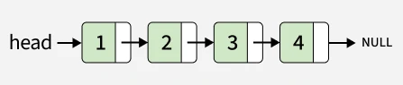
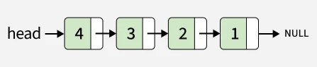
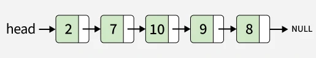
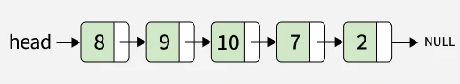
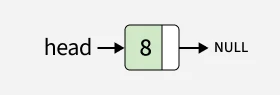

# Reverse Linked List

Problem Link: https://www.geeksforgeeks.org/problems/reverse-a-linked-list/1

---

## Problem Statement

You are given the head of a singly linked list. You need to reverse the linked list and return the head of the reversed list.

---

## Examples

### Example 1

```text
Input:


Output:
4 -> 3 -> 2 -> 1

Explanation:
After reversing the linkedList

```

### Example 2

```text
Input:


Output:
8 -> 9 -> 10 -> 7 -> 2

Explanation:
After reversing the linked list

```

### Example 3

```text
Input:


Output:
8

Explanation:

```

---

## Constraints

```text
1 ≤ number of nodes ≤ 105
1 ≤ node->data ≤ 105
```
