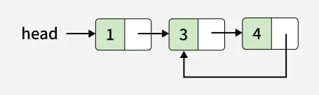
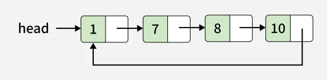

# Detect Loop Linked List

Problem Link: https://www.geeksforgeeks.org/problems/detect-loop-in-linked-list/1

---

## Problem Statement

You are given the head of a singly linked list. You have to determine whether the given linked list contains a loop or not. A loop exists in a linked list if the next pointer of the last node points to any other node in the list (including itself), rather than being null.

Note: Internally, pos(1 based index) is used to denote the position of the node that tail's next pointer is connected to. If pos = 0, it means the last node points to null. Note that pos is not passed as a parameter.

---

## Examples

### Example 1

```text
Input:
pos = 2,


Output:
true

Explanation:
There exists a loop as last node is connected back to the second node.
```

### Example 2

```text
Input:
pos = 0,


Output:
false

Explanation:
There exists no loop in given linked list.
```

### Example 3

```text
Input:
pos = 1,


Output:
true

Explanation:
There exists a loop as last node is connected back to the first node.
```

---

## Constraints

```text
1 ≤ number of nodes ≤ 105
1 ≤ node->data ≤ 103       
0 ≤ pos ≤ number of nodes
```
